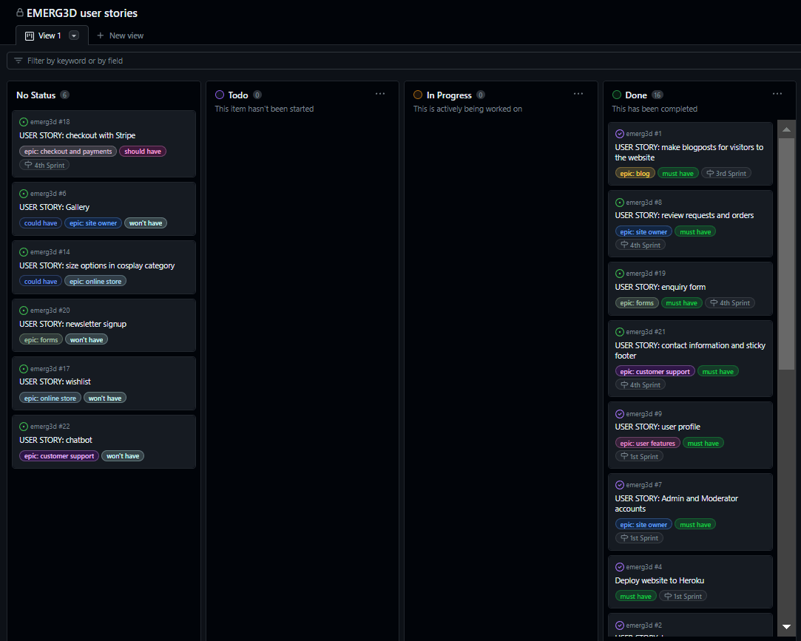
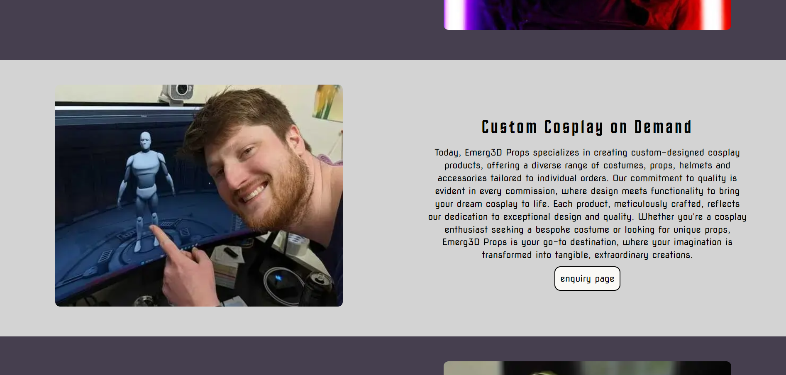
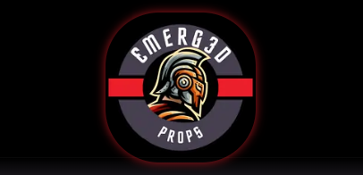

# EMERG3D Props


EMERG3D Props is a 3D printing business. This is their website (1st itertion made for my Portfolio Project 4 for Code Institute)

---

## Contents

* [User Experience](#user-experience) 🪄
  * [Strategy Plane](#strategy-plane)
    * [Project Goals](#project-goals)
  * [Scope Plane](#scope-plane)
    * [Feature Identification](#feature-identification)
  * [Structure Plane](#structure-plane)
    * [User Stories](#user-stories)
    * [Database Schema](#database-schema)
  * [Skeleton Plane](#skeleton-plane)
    * [Wireframes](#wireframes)
  * [Surface Plane](#surface-plane)
    * [Color Scheme](#color-scheme)
    * [Fonts](#fonts)
    * [Photography](#photography)
* [Agile Methodology](#agile-methodology) 🗃️
  * [Sprints](#sprints)
* [Features](#features) ✨
  * [Current Features](#current-features)
  * [Future Features](#future-features)
* [Technologies](#technologies) 🌐
  * [Languages](#languages)
  * [Database](#database)
  * [Frameworks](#frameworks)
  * [Libraries & Packages](#libraries--packages)
  * [Programs](#programs)
* [Testing](#testing) 📝
* [Bugs and Fixes](#bugs-and-fixes) 🛠️
* [Deployment](#deployment) 🖥️
* [Credits](#credits) 💐
  * [Code](#code)
  * [Content](#content)
  * [Media](#media)
  * [Acknowledgments](#acknowledgments)

---

## User Experience 🪄

### Strategy Plane

#### Project Goals

Emerg3D Props is primarily a Business to Consumer (B2C) website. Following on from a successful social media presence of Emerg3D (INSTAGRAM), the site owner would like a platform to engage in longer form communication with followers in the form of blog posts. The site owner would also like to provide an official way for customers to request collaboration and commission projects (currently this is only possible through direct messages on social media) as well as an online store for pre-printed products (divided into the categories of homeware and cosplay items). Another goal for the website is to showcase links to social media pages.

3D printing is a rapidly expanding industry and Emerg3D Prop’s goal is to establish a presence online in Ireland and worldwide.

### Scope Plane

#### Feature Identification

Planning for the website was undertaken in stages. The first step was meeting with the site owner to find out what they hoped to have delivered and then ranking these requests in order of importance, viability and deciding on the Minimum Viable Product (MVP) they would be happy with.

Although originally, it was hoped that Stripe payment system would be implemented, it was ultimately decided that the solution Shopify would be adopted in the next iteration of the website to handle the site's e-commerce.

The following features were identified:

| User Type | Feature | Importance | Viability | MVP | Achieved |
| -- | -- | -- | -- | -- | -- |
| Admin | Blog | 5 | 5 | YES  | ✅ |
| Admin* | View authored blogposts on profile | 5 | 5 |  | ✅ |
| Admin | Online store | 5 | 5 | YES | ✅ |
| Admin | Edit/delete shop items | 5 | 5 | YES | ✅ |
| Admin | Feature best sellers on homepage | 4 | 3 |  |  |
| Admin | Gallery | 3 | 4 |  |  |
| Admin | Social media links | 5 | 5 | YES | ✅ |
| Admin | Chatbot for customer queries | 1 | 1 |  |  |
| User | Enquiry form | 5 | 5 | YES | ✅ |
| User | Wishlist | 3 | 3 |  |  |
| User | Product reviews | 4 | 3 |  |  |
| User* | Make blog posts | 4 | 4 |  | ✅ |
| User | Like and comments on posts | 5 | 5 | YES | ✅ |
| User | View liked posts on profile | 4 | 4 |  |  |
| Both | About page | 5 | 5 | YES | ✅ |
| Both | Secure login and logout | 5 | 5 | YES | ✅ |
| Both | Enquiry history | 5 | 5 |  | ✅ |
| Both | Order history | 5 | 3 |  | |
| Both | Automated confirmation of orders | 4 | 4 |  |  |
| Both | Payment via Stripe | 4 | 4 |  |  |
| Both | Account profile | 5 | 5 | YES | ✅ |
| Both | Filter items in store by category | 4 | 4 |  | ✅ |

*In this case Admin/User refers to authorised users with Moderator=True

### Structure Plane

#### User Stories

User stories what were identified, were then linked to feature 'epics'. (There is more on their prioritisation in Agile Methodology section)

| Epic | As a.. | I would like to be able to.. | So that I can.. |
| -- | -- | -- | -- |
| *View* | USER | Scroll one main page | Easily learn about what EMERG3D props site offers |
|  | USER | I can see links to Emerg3D social media | View their social media profiles |
|  | USER | See a short introduction/description of what Emerg3D | I can Learn about the company |
| *Site Owner* | ADMIN | Review requests and orders | Manage my business |
|  | ADMIN | Log in to a secure management account |  Manage my business website and assign moderators to help with uploading and managing content |
|  | ADMIN | Showcase customers photos of their purchases/projects in a gallery | Engage with my followers/audience |
| *User Features* | USER | Create an account | Interact with blogposts, make purchases and requests |
| *Checkout and Payments* | USER | Use a trusted payment service when checking out | I can make purchases easily and without worry |
| *Forms* | ADMIN | Provide users with a form to request a project | I can Make customised orders for customers |
|  | USER | Sign up for a newsletter | I can Stay up-to-date with Emerg3D |
| *Customer Support* | ADMIN | Provide contact information to users | Reassure them and provide customer support |
| *Blog* | ADMIN | publish blog posts to share my current progress, events and products | I can update visitors regularly |
| | MODERATOR |  Showcase my work and activities, share information | Engage with my followers/audience |
| *Online Store* | ADMIN | Provide multiple sizes for items in the cosplay store | Facilitate more customers |
|  | USER |save products to a wish list | return to items I like later |
| none | DEV | Deploy website to Heroku | Link the repository to Heroku with installed dependencies and config vars |

<details>The CRUD functionality of each feature is shown below:
<summary>
 </summary> </details>

#### Database Schema

MySQL was used to create the database design.


The 'CustomUser' model was adapted from Django's 'AbstractUser' model. All the other models are custom models.

In the blog_post model, CustomUser is a foreign key (of one-to-many) however, only users who have the boolean value for 'is_moderator' set to true can create a blog post. This can be toggled on the Admin site by the site owner.

The enquiry_form model also uses the foreign key of the CustomUser is a one-to-many capacity. The budget was programmed to be optional. When a user selects a country, this is from a prepopulated list of selectable countries stored in a constant.py file of tuples approved by the site owner.

The product_category model can be linked to the products model. If a category is deleted, there is no CASCADE delete because this could potentially delete many products from the site. Instead, if a product_cetegory is deleted, this value of an individual product that posessed this foreign key defaults to null.

An order model was originally designed. After researching further into creating a checkout, I discovered it would be more optimal to create two models for this purpose - am order_item model AND an order model so that multiples of various items can be added to the order and it is easier to edit. This model has not been implemented as the revised goal is to implement Shopify to handle e-commerce on the site.

### Skeleton Plane

#### Wireframes

The following wireframes were created using Balsamiq:

Base Template


Home Page


Blog


Blogpost


Store


Product


Enquiry page


Registration page


Login page


Profile page featuring Django Messages alert


Profile page with enquiry ticket modal


#### Surface Plane

#### Color Scheme

Basic Palette

Hexadecimal codes that correspond to the company's logo were provided by the client. It was decided 'off-white' would replace the standard white color for text as it creates less of a glare while still maintaining sufficient contrast for accessibility.


The colors were then imported into the base.css page and assigned as root colors for ease of use (and all elements using the tags can be instantly amended site-wide in future if the logo changes).


#### Fonts

Horta

The headline font 'Horta' is used in the company logo and has an open font license.

> "Inspired by the title cards of the original Star Trek television series—even supports Klingon!"
>> Source: [FontLibrary.org](https://fontlibrary.org/en/font/horta)

Sample of Horta font:


Nova Square

The body font 'Nova Square' was chosen for its striking simplicity. It was created by the famous stonemason [Wojciech Kalinowski](http://www.identifont.com/show?3DQU)

> "In 1995 he began to design his own typefaces for carving in stone, like Medieval Sharp, Gothica, and Modern Antiqua. In second half of the 2000's he became interested in digital typefaces, and began to digitise his old typefaces and design new ones. He is a contributor to the Open Font Library."

Sample of Nova Square font:


#### Photography and Logo

All the photos used in the products page and for the homepage were taken by Damien Moreau.

The EMERG3D Props logo was created by Damien Moreau using Canva.

---

## Agile Methodology 🗃️

This project was developed using Agile methodologies. The information radiator 'GitHub projects' was used to log the user stories. GitHub provides many pre-made labels for this purpose and you can 'view-by' filter these at any time. As seen here when filtered by '1st Sprint' (The 1st sprint issues may also be viewd in 'milestones'). I found this tool very helpful in keeping track of schedule during the development of this project.


I created additional labels for my 'project issues'. Issues may also be assigned to certain members of a team. I became aware later on in the project that issue numbers can be directly linked in commit messages which I will implement in future projects as this helps track progression even further.


As previously mentioned, epics were identified across the various user stories, MoSCoW prioritisation was utilised throughout the project and each issue was assigned both an epic label and MoSCoW label (must have, should have, could have or won't have). As issues were completed, each was moved from To Do --> In Progress and finally --> Done on the KanBan board. Unimplemented user stories remain in the 'no status' column.



The [GitHub project](https://github.com/users/modonohoe/projects/2) for this project is publicly available at on my GitHub profile.

### Sprints

The development of the project was seperated into four 'sprints'(time boxes). Each sprint was assigned approximately one week. Luckily, sprint 1, 2 and 3 had no leftover issues. After each sprint, issues should be reviewed so that backlog items do not affect the following sprint. Sprint 4 is 50% complete and this is because the development of a checkout was abandoned.


---

## Features ✨

### Current Features

The website currently has a homepage with a carousel. The template for this Bootstrap page layout was adopted from [w3schools](https://www.w3schools.com/bootstrap/bootstrap_templates.asp)


The about us section gives the user information about the services offered and a 'face' behind the business.




The shop feature begins with the disclaimer that payment on the website is not yet possible. The sorting and filtering bars appear above the products as well as a pagination to move onto a new page every 6 items. 


There are hover effects on the 'see all' button and when the user hovers over a product card. This hover effect also feature  on the Nav bar and home logo




The Emerg3D blog has a preview image for each blog entry and displays the authors name and when they posted. The blog titles are clickable links to bring up the full post.


Permission to grant access for moderators can be done via the admin page. Moderators can create, update and delete blogs. 


Blogs are rendered by their unique slug (which is generated from the title). 
Below the blog content, users can 'like' the post and also see a tally of the comments.


Only authenticated users can leave comments or make enquiries which adds a level of identification to the poster and can mitigate spam or trolling messages.


The enquiry ticket feature include 5 input fields, one being a calendar. If a date in the past or a non-date is entered, this will be flagged and the user is prompted to re-enter a date. The available countries were chosen by the site owner and users cannot just type in any country.


User's profile page has a welcome message with their email address displayed so they know where to expect communication from Emerg3D. Active tickets are also displayed with either - pending or accepted status. Is tickets have been accepted by Admin via the admin site, the ticket are no longer editable by the user.


There are two modals for the profile page - one for editing tickets and one for deleting. 


Safety features of the website include non-authenticated users being forbidden from accessing the enquiry form and Django's built-in password authentification features. I did have to specify that multiple accounts could not be created with the same email address because in the beginning this was possible! 


The final nav bar list item changes depending on who is logged in or if they are logged in. This is coded with a 'if' statement in the base.html template and so applies to all pages.


Lastly the footer has been coded to only appear after the full height of the body has been seen so there is no overlap but it remains fixed like a sticky footer.

 

### Future Features

The site owner would like to see implementation of Shopify for e-commerce, a gallery, a chatbot and a bestseller section on the homepage.

As a developer, future features I would like to include are:
- a 'liked blogposts' tab on user's profiles
- further security measures for login and registration
- log in via social accounts Google Account etc
- password reset option
- automated emails for both admin and user when a ticket is submitted
- review feature for the shop

---

## Technologies 🌐

### Languages

### Database

### Frameworks

### Libraries & Packages

### Programs

---

## Testing 📝

---

## Bugs and Fixes 🛠️

<details>
<summary> Bug: Preview on Port 8000 loading as 'Dangerous Website'</summary>

| Preview Bug | Details |
| -------- | -------- |
| Description: | When loading a preview of my website on Port 8000 after deploying my site to Heroku, a warning page appeared in the browser blocking entry to the site |
| Steps to reproduce: | 1. Deploy Django website to Heroku.<br>2. Use 'python3 manage.py runserver' command in the IDE terminal.<br>3. View Port 8000  |
| Expected behaviour: | I expected to see the 'Django launched successfully' page which I had seen before deployment to Heroku |
| Actual behaviour: |  |
| Environment: | Operating system: Windows 11<br>IDE: Code Anywhere<br>Browser: Chrome Version 120.0.6099.71 |
| Possible causes: | The issue arose once Heroku successfully deployed the site. |
| Additional information: | n/a |
| Steps to fix: | 1. Changing permissions to allow access in the chrome settings ❌<br>2. The issue was because I did not have any views in place yet. This was confirmed when we tried to view the admin app, which loaded without issue in Port 8000.|
| References: | n/a |
| Status: | Resolved ✅ |

</details>

<details>
<summary> Bug: CSS path error</summary>

| Path Bug | Details |
| -------- | -------- |
| Description: | CSS file did not load custom styling to Bootstrap template |
| Steps to reproduce: | 1. Create style.css in folder CSS in static files<br>2. Preview site on Port 8000 |
| Expected behaviour: | I expected to see the curved container edges removed and custom color styling applied to my Bootstrap template. |
| Actual behaviour: | Chrome Developer Tools revealed the CSS was not loading succesfully  |
| Environment: | Operating system: Windows 11<br>IDE: Code Anywhere<br>Browser: Chrome Version 120.0.6099.71 |
| Possible causes: | Incorrect path or unknown error |
| Additional information: | n/a |
| Steps to fix: | 1. Checked the path to my CSS file and this looked in order.<br>2. After troubleshooting, I contacted Tutor Support who supplied me with the following screenshot:<br><br>The path appeared to me to be within the folder but as I had never encountered this error before, I mistook the indentation for the file being within the folder.
| References: | n/a |
| Status: | Resolved ✅ |

</details>

<details>
<summary> Bug: Django App Name </summary>

| Preview Bug | Details |
| -------- | -------- |
| Description: | When I tried to make an app called 'home', this was not permitted. |
| Steps to reproduce: | 1. In the terminal use the command: 'python3 manage.py startapp home' |
| Expected behaviour: | Creation of new app called 'home' |
| Actual behaviour: | As python has a module named 'home' this is not permitted<br> |
| Environment: | Operating system: Windows 11<br>IDE: Code Anywhere<br>Browser: Chrome Version 120.0.6099.71 |
| Possible causes: | Python permissions |
| Additional information: | n/a |
| Steps to fix: | I chose the name 'landing_page' which is inline with naming conventions. 'home_' was also considered. |
| References: | [GitHub discussion on this topic](https://github.com/nephila/djangocms-installer/issues/359) |
| Status: | Resolved ✅ |

</details>

<details>
<summary> Bug: Migration conflict</summary>

| Preview Bug | Details |
| -------- | -------- |
| Description: | When attempting to migrate my first app, an InconsistentMigrationError was raised `Migration admin.0001_initial is applied before its dependency accounts.0001_initial on database 'default'` |
| Steps to reproduce: | 1. In the terminal use the command: 'python3 manage.py migrate accounts' |
| Expected behaviour: | A successful migration of the accounts models to the ElephantSQL database. |
| Actual behaviour: |  |
| Environment: | Operating system: Windows 11<br>IDE: Code Anywhere<br>Browser: Chrome Version 120.0.6099.71 |
| Possible causes: | 1. I created an instance of a superuser which is part of the Admin site.<br>2. Default Django apps need to be migrated before any custom apps are created as they depend on these. |
| Additional information: | n/a |
| Steps to fix: | 1. Reset the database on ElephantSQL to remove the migration of accounts app.<br>2. Ran the command 'python3 manage.py migrate accounts' and the migration was successful |
| References: | n/a |
| Status: | Resolved ✅ |

</details>

<details>
<summary> Bug: Code Anywhere reserved URL</summary>

| Preview Bug | Details |
| -------- | -------- |
| Description: | When trying to preview my 'login.html', there was a 403 Error |
| Steps to reproduce: | 1. Use 'python3 manage.py runserver' command in the IDE terminal.<br>2. View Port 8000 with app url + 'login/' |
| Expected behaviour: | Get a preview of my login.html page |
| Actual behaviour: | The URL of my website changed to a Code Anywhere one instead of a heroku URL and displayed a 403 error.<br> |
| Environment: | Operating system: Windows 11<br>IDE: Code Anywhere<br>Browser: Chrome Version 120.0.6099.71 |
| Possible causes: | 'login' is a reserved URL for Code Anywhere |
| Additional information: | n/a |
| Steps to fix: | Rename 'login.html' to 'signin.html' |
| References: | n/a |
| Status: | Resolved ✅ |

</details>

<details>
<summary> Bug: Summernote Admin view</summary>

| Preview Bug | Details |
| -------- | -------- |
| Description: | Broken link appearing for Admin summernote view |
| Steps to reproduce: | Install the same versions of requirements in requirement.txt. Apply summernote field to text area in the blog model in models.py |
| Expected behaviour: | WYSIWYG editor for blogposts to appear in Admin view |
| Actual behaviour: | This was not loading and appeared to be broken:  |
| Environment: | Operating system: Windows 11<br>IDE: Code Anywhere<br>Browser: Chrome Version 120.0.6099.71 |
| Possible causes: | Django and summernote versions |
| Additional information: | n/a |
| Steps to fix: | In settings.py enter ```X-FRAME-OPTIONS``` as SAMEORIGIN:<br>  |
| References: | This solution was given to me by Tutor Support who had encountered it before but rarely and said it was due to the versions of Django and Summernote |  
| Status: | Resolved ✅ |

</details>

<details>
<summary> Bug: Successful deletion message</summary>

| Preview Bug | Details |
| -------- | -------- |
| Description: | On the profile page, when users edit their tickets, they received a 'ticket edit was a success' message that appears on the page via Django Messages. I have coded one for succesful deletion too but this does not appear. |
| Steps to reproduce: | In my Javascript deleteTicket function (see accounts app, profile.html file), success should display a message to the user. |
| Expected behaviour: | The same as for successful edit and comment:<br> |
| Actual behaviour: | All of the Javascript function performs its task, the ticket is deleted, the page is refreshed but the success message does not show. |
| Environment: | Operating system: Windows 11<br>IDE: Code Anywhere<br>Browser: Chrome Version 120.0.6099.71 |
| Possible causes: | unknown |
| Additional information: | I used DiffChecker to see if the Edit and Delete success functions were both the same and they are:<br> |
| Steps to fix: | n/a |
| References: | n/a |  
| Status: | Unresolved |-->

<!-- 


<!-- | Preview Bug | Details |
| -------- | -------- |
| Description: |  |
| Steps to reproduce: |  |
| Expected behaviour: |  |
| Actual behaviour: |  |
| Environment: | Operating system: Windows 11<br>IDE: Code Anywhere<br>Browser: Chrome Version 120.0.6099.71 |
| Possible causes: |  |
| Additional information: |  |
| Steps to fix: |  |
| References: |  |  
| Status: | Resolved ✅ |-->

---

## Deployment 🖥️

---

## Credits 💐

### Code

### Content

### Media

### Acknowledgments
