# Testing and Validation

## Testing Contents
- [Testing and Validation](#testing-and-validation)
  - [Testing Contents](#testing-contents)
  - [User Stories](#user-stories)
  - [Code Validation](#code-validation)
    - [HTML and CSS](#html-and-css)
    - [JS and Python](#js-and-python)
  - [Form and User Validation](#form-and-user-validation)
  - [Responsivity](#responsivity)
  - [Accessibility](#accessibility)

## User Stories

Updated list of completed and manually tested User Stories:

| no. | User Story | Complete | Reviewed |
| -- | ---- | ---- | -- |
| 1 | Blogposts for visitors to the website: As a site owner I can publish blog posts to share my current progress, events and products so that I can update visitors regularly | YES  | ✅ |
| 2 | Homepage: As a user I can Scroll one main page so that I can Easily learn about what is on offer | YES | ✅ |
| 3 | Website Description: As a user I can See a short introduction/description of what Emerg3D is so that I can Learn about the company | YES | ✅ |
| 4 | Deploy website to Heroku: link the repository to Heroku with installed dependencies and config vars | YES | ✅ |
| 5 | Social media links: As a user I can see links to Emerg3D social media so that View their social media profiles | YES | ✅ |
| 7 | Admin and Moderator accounts: As a Site owner I can Log in to a secure account so that Manage my business website and assign moderators to help with uploading and managing content | YES | ✅ |
| 8 | Review requests: As a site owner I can Review requests so that I can Manage my business | YES | ✅ |
| 9 | User Profile: As a user I can Create an account so that Interact with blogposts, make purchases and requests | YES | ✅ |
| 10 | Blog: As a verified user (moderator) I can Showcase my work and activities, share information so that Engage with my followers/audience/customers | YES | ✅ |
| 12 | Product Categories: As a site owner I can Display items in the store in different sections so that I can Provide better UX for my customers | YES | ✅ |
| 13 | Product filter by categories: As a user I can Filter items in the store by category so that I can Navigate the store easier | YES | ✅ |
| 15 | Product Image: As a site owner I can Include photos in my item descriptions so that Give realistic expectations to my customers and better UX | YES | ✅ |
| 16 | Product Previews: As a user I can browse items in the store with previews so that so I do not have to click into the product page | YES | ✅ |
| 19 | Enquiry form: As a Site owner I can Provide users with a form to request a project so that I can Make customised orders for customers | YES | ✅ |
| 21 | Contact information and sticky footer | YES | ✅ |

## Code Validation

### HTML and CSS

The HTML validator raises errors with Django formatting as 'bad values' for each page. 

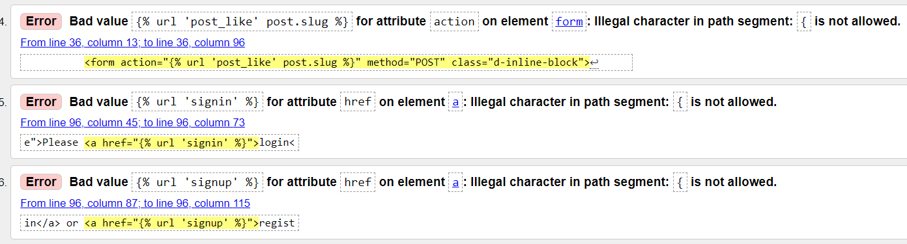

You can see a better representation here, where the injected links are flagged:

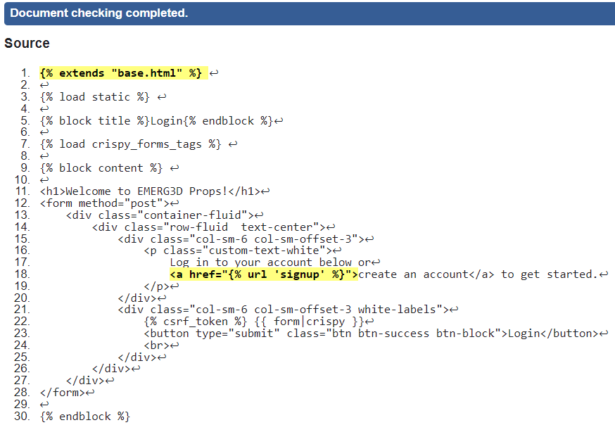

When these are ommitted, the HTML passes without error except for one instance of an anchor tag inside a button. This is bad practice - even with an ARIA label. In order to amend this, I will have to create a custom button in the next iteration on the product page as this was identified in the final hours of production. In future I will not place anchor tags INSIDE buttons - or vice versa (which is also no allowed).

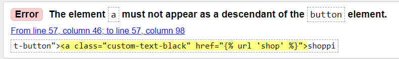

CSS was error free when passed through the W3C validator:
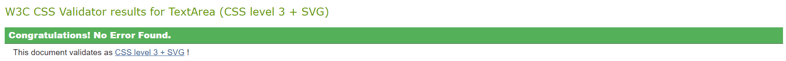

### JS and Python

My Javascript functions on the profile.html page were tested and returned no issues.

My Python code was checked and often flagged as too long.. This was rarely over 100 characters in a line but I have kept my code slightly long as I was worried about 'new-lining' everything. I will be more aware of this issue in my next project.

I created a visual to show how widespread this issue was:

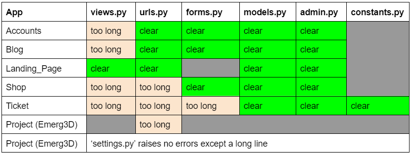
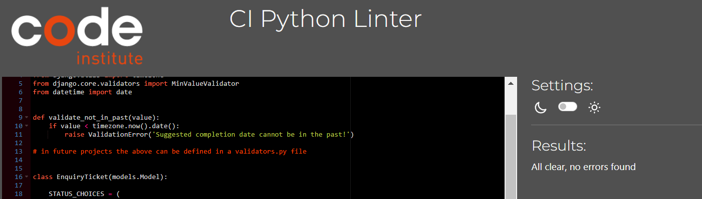

The python code itself was cleared with no errors after I added a blank 'endline' to a couple of the files.

## Form and User Validation

All models and forms were extensively tested.

The enquiry form model was redone when it was accepting dd/mm/yyyy as an entry.

The registration model no longer accepts the same email address for multiple accounts (although it does accept fake email addresses...)

Tickets were created, edited and deleted many many times without error. And tickets were put in 'accepted' state which never resulted in the user being able to edit it.

At one point everytime the page refreshed after a blog comment, the comment would post again. This was remedied by refreshing and clearing the form after save.

## Responsivity

The website was tested on Windows and Mac devices. Desktop and Mobile and works expected.
I used Google Developer Tools to test a wide range of screen sizes.

One of my 'testers' uncovered this issue on a Huawei p30 Lite mobile phone:

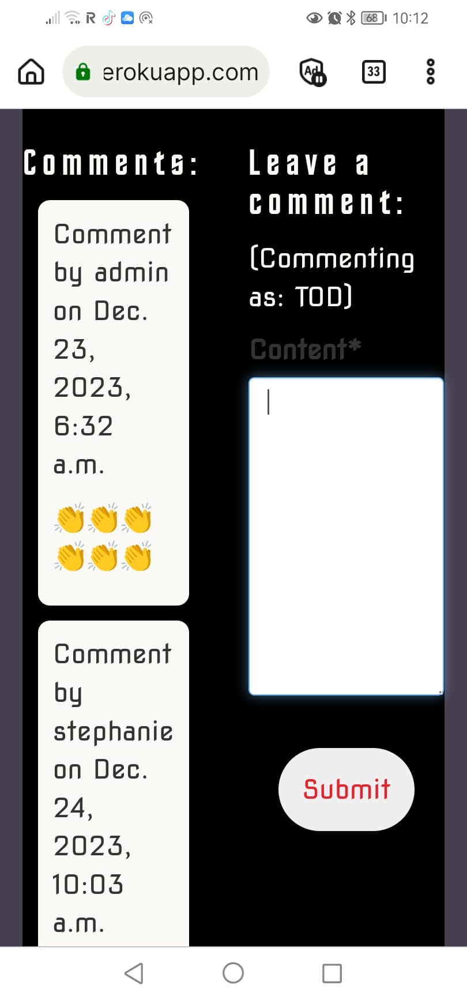

This responsivity issue has been resolved.

Media queries were created when needed but Bootstraps built-in fluid containers and rows handled a lot of my reponsivity demands.

## Accessibility

Accessibility testing was conducted using Google Lighthouse. 

Thankfully my lack of ARIA labelling on the carousel and hamburger menu that I adopted from W3schools was caught. I did not know these had specific label requirements - such as letting the screen reader know that the toggle is specifically for the main menu.

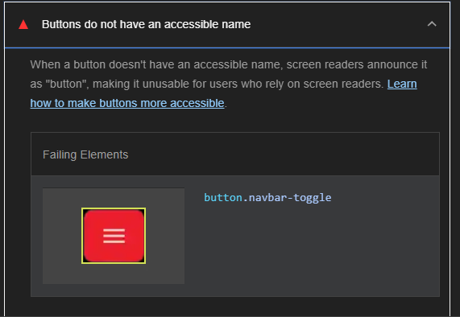

I also forgot to give alt texts to my header images in the carousel and this was also caught and fixed. Suprisingly, one of my buttons (white with red text) was not sufficiently contrasted but by boldening the text this was resolved.

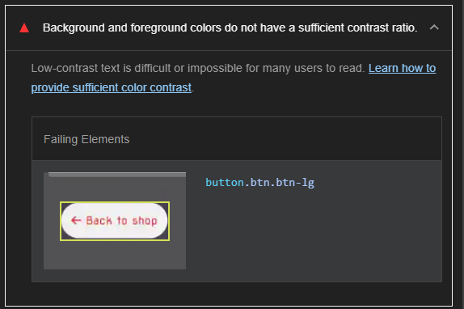

The biggest improvement was achieved after testing on the homepage. Once the ARIA labels were correctly attributed to the carousel and navbar (which also appears sitewide) and the accessibility was in the green on every page.

Here are the results for the homepage before:

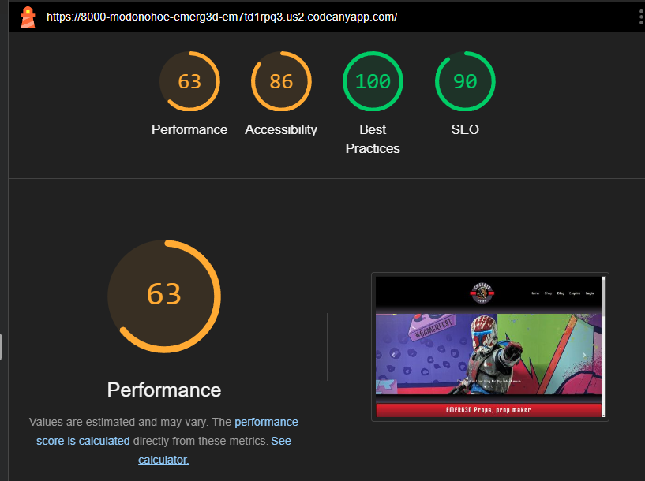

And this is the lighthouse result after:

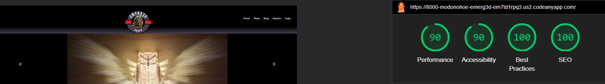

As you can see in the above results, my 'performance' scores site wide were suprisingly bad. I was unsure why my images were being flagged as too large when I had already minimized them on Optimizilla. I researched more into webp formatting and consequently reuploaded the images to this format. This dramatically improved my performance scores on the website.

The compressor website I used to achieve these results is called [Compress or Die](https://compress-or-die.com/webp):

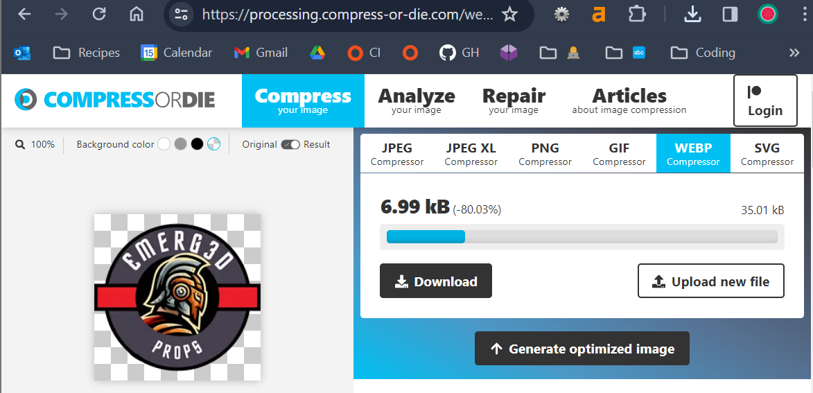

Lighthouse results for remaining pages:

1. Shop

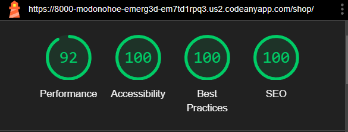

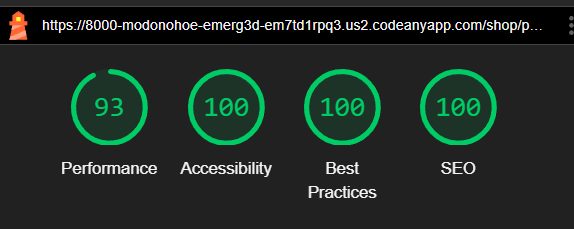

2. Blog

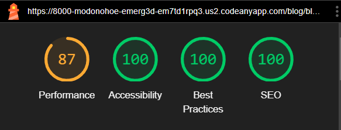

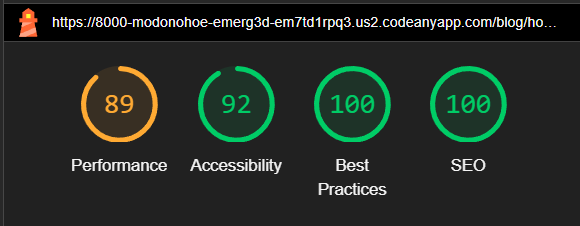

3. Enquiry Form

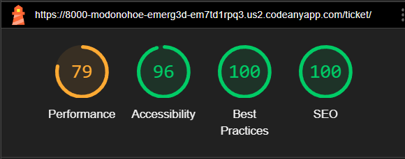

4. Profile Page

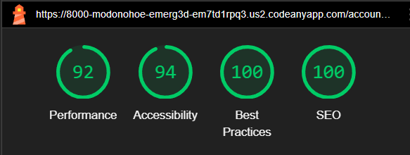
